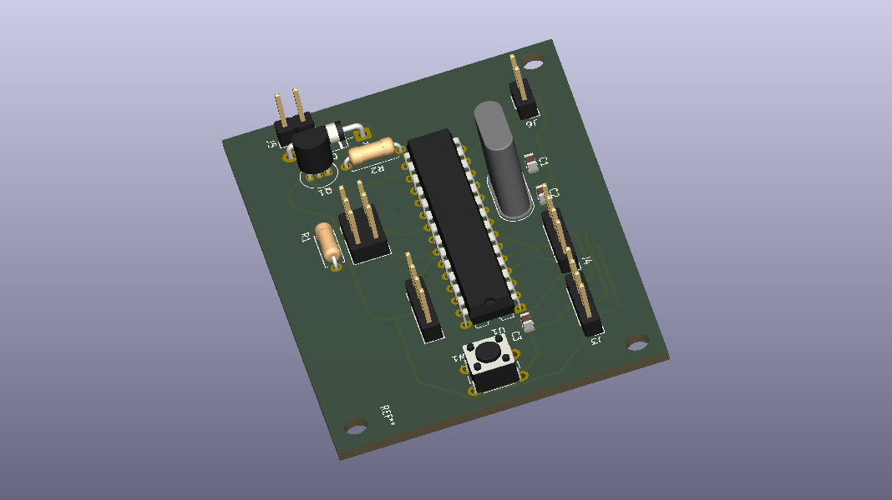
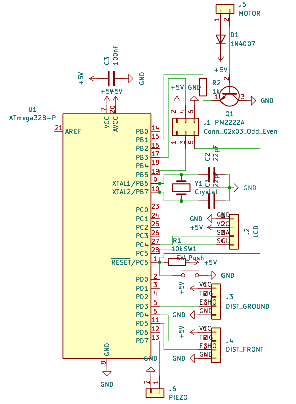
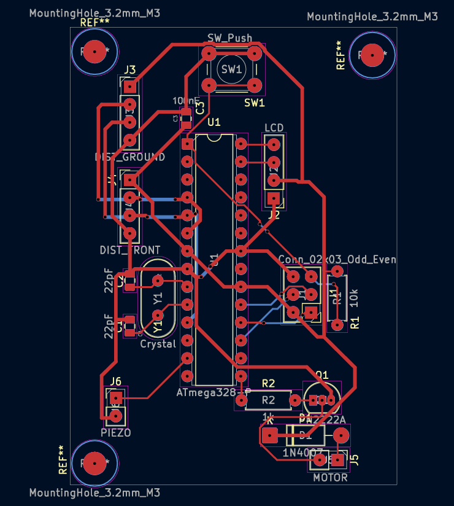

# ATmega328P Smart Assistive Navigator PCB

<p align="center">

</p>


</p>
Designed as a personal learning project to understand the complete PCB development workflow from schematic capture to fabrication-ready outputs using KiCad.

---

# Project Overview

This project documents the complete design of a custom two-layer printed circuit board (PCB) for an ATmega328P-based assistive navigation hardware platform.

The primary objective was to gain practical experience with the complete PCB design workflow rather than relying on development boards such as the Arduino Uno. The design process included schematic capture, footprint assignment, PCB layout, routing, electrical verification, design rule checking (DRC), and fabrication file generation using KiCad.

Although the board has not been physically manufactured or tested, the project successfully demonstrates a complete PCB design workflow suitable for fabrication.

---

# Objectives

- Learn professional PCB design using KiCad
- Design a custom PCB around the ATmega328P microcontroller
- Understand schematic capture and PCB layout
- Learn component placement strategies
- Perform manual PCB routing
- Verify the design using Design Rule Checks (DRC)
- Generate fabrication-ready Gerber and drill files

---

# System Features

- ATmega328P microcontroller
- Dual HC-SR04 ultrasonic sensor interfaces
- I²C LCD display interface
- Piezo buzzer output
- PN2222A transistor-based vibration motor driver
- External 16 MHz crystal oscillator
- AVR ISP programming header
- Reset push button
- Decoupling capacitor
- Two-layer PCB layout

---

# Hardware Components

| Component | Purpose |
|------------|------------------------------|
| ATmega328P | Main microcontroller |
| HC-SR04 ×2 | Obstacle detection |
| 16 MHz Crystal | System clock |
| 22 pF Capacitors | Crystal load capacitors |
| 100 nF Capacitor | Power supply decoupling |
| PN2222A | Motor driver transistor |
| 1N4007 | Flyback protection diode |
| Piezo Buzzer | Audio feedback |
| I²C LCD Header | Display interface |
| AVR ISP Header | Programming interface |
| Push Button | Reset switch |

---

## PCB Specifications

| Parameter | Value |
|-----------|--------|
| PCB Software | KiCad 10 |
| Board Type | Custom PCB |
| PCB Layers | 2 |
| Routing | Manual |
| Mounting Style | Through-Hole (THT) |
| Microcontroller | ATmega328P-PU |
| Board Verification | Design Rule Check (DRC) Passed |
| Manufacturing Files | Gerber + Drill Files Generated |
| PCB Status | Fabrication-Ready Design |

Copper Thickness: 1 oz (standard fabrication assumption)

Minimum Trace Width:
0.25 mm

Minimum Clearance:
0.20 mm

## Design Workflow

This project followed a complete PCB development workflow:

1. Requirement definition
2. Schematic capture
3. Component footprint assignment
4. PCB floorplanning
5. Manual component placement
6. Manual two-layer routing
7. Design Rule Check (DRC)
8. Fabrication file generation
9. 3D verification
10. Documentation

---

# Design Validation

| Check | Status |
|---------|---------|
| Electrical Rule Check (ERC) | Completed |
| Design Rule Check (DRC) | Passed |
| PCB Routing | Completed |
| Gerber Files | Generated |
| Drill Files | Generated |
| Ready for Fabrication | Yes (Design Only) |
| Physical Assembly | Not Performed |

> **Note:** This project has not been physically manufactured or electrically validated. "Ready for Fabrication" indicates that the design files were successfully generated and verified using KiCad's design checks.

---

## Repository Structure

```text
ATmega328P-Smart-Assistive-Navigator-PCB
│
├── README.md
│
├── hardware
│   ├── SAN PCB.kicad_pcb
│   ├── SAN PCB.kicad_sch
│   ├── SAN PCB.kicad_pro
│
├── firmware
│   └── SAN.ino
│
├── fabrication
│   ├── Fabrication_Files.zip
│   └── README.md
│
├── bom
│   └── BOM.csv
│
├── docs
│   ├── SAN PCB.pdf
│   └── SAN PCB PrintView.pdf
│
└── images
    ├── SAN PCB 3d_Back.png
    ├── SAN PCB 3d_Front.png
    ├── SAN PCB 3d_Isometric.png
    ├── SAN PCB PrintView.pdf
    └── SAN PCBschmmView.pdf
```
---

# Gallery

## Design Files

<p align="center">
  
  
</p>

<p align="center">
<b>Schematic</b>&nbsp;&nbsp;&nbsp;&nbsp;&nbsp;&nbsp;&nbsp;&nbsp;&nbsp;&nbsp;&nbsp;&nbsp;&nbsp;&nbsp;&nbsp;&nbsp;&nbsp;&nbsp;&nbsp;&nbsp;&nbsp;&nbsp;
<b>PCB Layout</b>
</p>

<p align="center">
<b>Schematic</b>
&nbsp;&nbsp;&nbsp;&nbsp;&nbsp;&nbsp;&nbsp;&nbsp;&nbsp;&nbsp;&nbsp;&nbsp;&nbsp;&nbsp;&nbsp;&nbsp;&nbsp;&nbsp;&nbsp;&nbsp;&nbsp;&nbsp;&nbsp;&nbsp;&nbsp;&nbsp;&nbsp;&nbsp;
<b>PCB Layout</b>
</p>

---

## Final PCB

<p align="center">


</p>

<p align="center">
<b>Front</b>
&nbsp;&nbsp;&nbsp;&nbsp;&nbsp;&nbsp;&nbsp;&nbsp;&nbsp;&nbsp;&nbsp;&nbsp;&nbsp;&nbsp;&nbsp;&nbsp;&nbsp;&nbsp;&nbsp;&nbsp;&nbsp;&nbsp;&nbsp;&nbsp;
<b>Back</b>
&nbsp;&nbsp;&nbsp;&nbsp;&nbsp;&nbsp;&nbsp;&nbsp;&nbsp;&nbsp;&nbsp;&nbsp;&nbsp;&nbsp;&nbsp;&nbsp;&nbsp;&nbsp;&nbsp;&nbsp;&nbsp;&nbsp;&nbsp;&nbsp;
<b>Isometric</b>
</p>
---

# Challenges Faced

During the development of this project I encountered several practical PCB design challenges including:

- Selecting appropriate footprints
- Crystal oscillator placement
- Decoupling capacitor positioning
- PCB routing optimization
- Managing trace intersections
- Using both copper layers effectively
- Resolving Design Rule Check (DRC) violations
- Preparing fabrication outputs

Working through these issues provided valuable hands-on experience with the PCB design process.

---
## Design Decisions

Several design decisions were made during the PCB layout to improve reliability and follow standard PCB design practices.

- Placed the 100 nF decoupling capacitor close to the ATmega328P power pins to reduce supply noise.
- Positioned the 16 MHz crystal oscillator adjacent to the microcontroller to minimize clock trace length.
- Used dedicated 22 pF load capacitors for crystal stability.
- Included an ISP programming header for firmware uploading and debugging.
- Used a PN2222A transistor to safely drive the vibration motor from the microcontroller.
- Added a flyback diode (1N4007) across the motor output to protect the transistor from inductive voltage spikes.
- Routed signal traces manually to reduce unnecessary crossings and improve readability.
- Performed Design Rule Checks (DRC) before generating fabrication files.
  
---


# Lessons Learned

Through this project I developed practical experience with:

- PCB schematic design
- Component footprint selection
- Two-layer PCB layout
- Manual routing techniques
- PCB design constraints
- Design verification
- Manufacturing file generation
- Professional engineering documentation
- Tradeoffs between routing simplicity and board compactness
- Importance of component placement before routing

---
## Skills Demonstrated

Through this project I gained practical experience in:

- PCB Design using KiCad
- Electronic Schematic Capture
- Footprint Selection
- Component Placement
- Manual PCB Routing
- Two-Layer PCB Design
- Design Rule Verification (DRC)
- Gerber File Generation
- Bill of Materials (BOM) Creation
- Hardware Documentation
- Basic Embedded Hardware Design
---

# Future Improvements

Future versions of this project could include:

- Physical PCB fabrication
- Hardware assembly and testing
- USB programming interface
- Improved component placement
- Reduced PCB dimensions
- Surface-mount (SMD) version
- Power supply optimization

---

# Author

**[Syed Ihteshamuddin]**

High School Student | Aspiring Electrical Engineer

Interested in:

- Electrical Engineering
- Embedded Systems
- PCB Design
- Hardware Development

GitHub: https://github.com/syedihteshamuddin

---

> This repository documents a personal learning project completed to develop practical skills in embedded hardware and PCB design.
